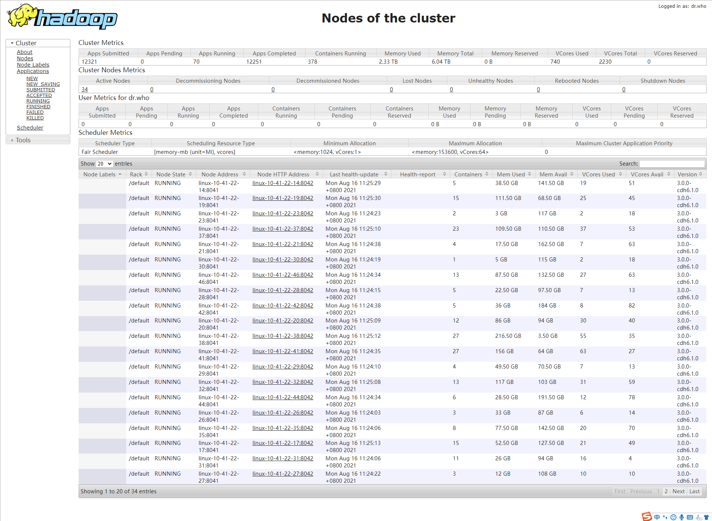

# 离线大数据平台

- [离线大数据平台](#离线大数据平台)
  - [All Nodes](#all-nodes)
  - [HDFS Overview](#hdfs-overview)
  - [HDFS Datanodes](#hdfs-datanodes)
  - [YARN Dynamic Resource Pools](#yarn-dynamic-resource-pools)
  - [YARN Nodes](#yarn-nodes)
  - [监控 - 主机](#监控---主机)
  - [监控 - 大数据集群](#监控---大数据集群)
  - [监控 - 数仓表监控](#监控---数仓表监控)

## All Nodes

## HDFS Overview

## HDFS Datanodes

## YARN Dynamic Resource Pools

## YARN Nodes

## 监控 - 主机

## 监控 - 大数据集群

## 监控 - 数仓表监控

