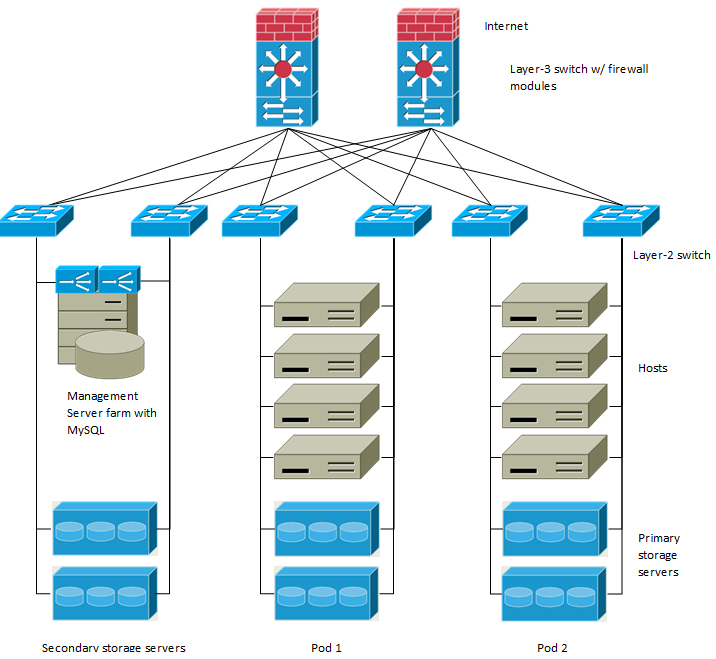
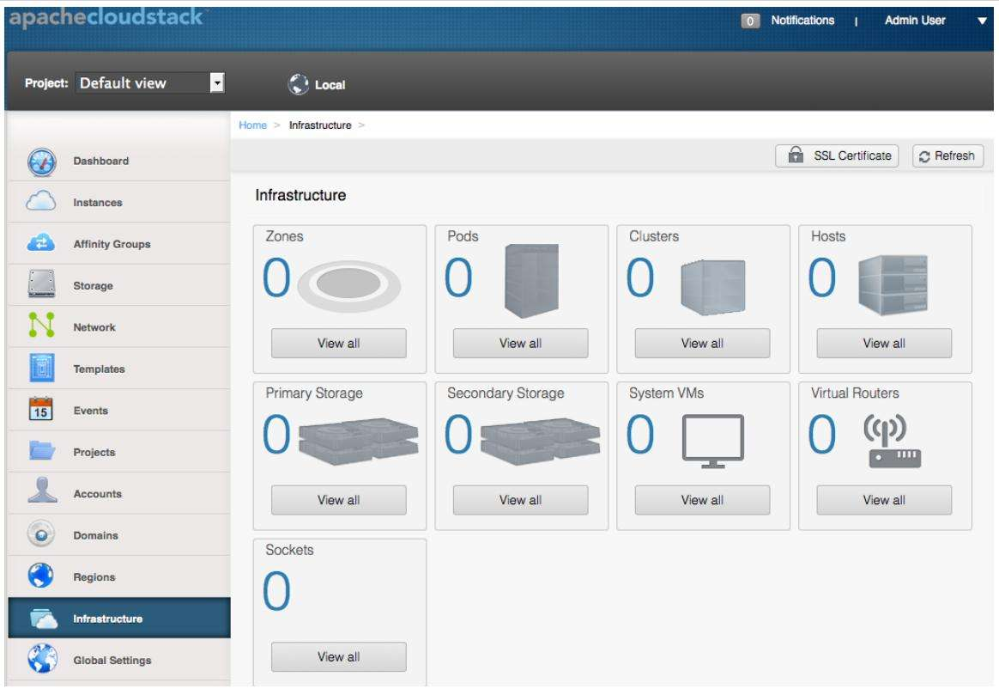
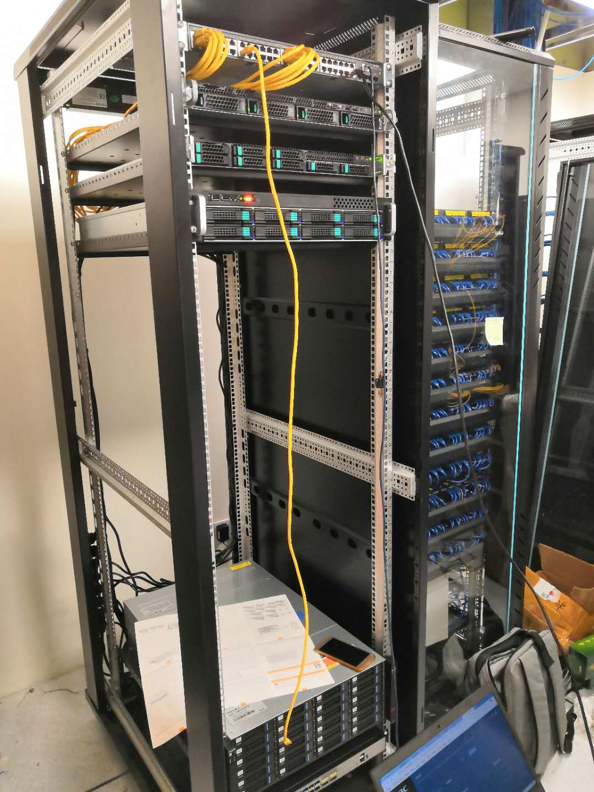

# 私有云

- [私有云](#私有云)
  - [技术方案对比](#技术方案对比)
  - [网络架构](#网络架构)
  - [CloudStack UI](#cloudstack-ui)
  - [机房](#机房)

## 技术方案对比

|          | OpenStack | CloudStack | vmware 等 |
| -------- | --------- | ---------- | --------- |
| 社区     | 5         | 4          | 3         |
| 文档     | 5         | 4          | 5         |
| 功能     | 5         | 4          | 5         |
| 操作友好 | 3         | 5          | 5         |
| 开放性   | 5         | 5          | 1         |
| 组建成本 | 3         | 5          | 3         |
| 运维成本 | 2         | 5          | 3         |

## 网络架构

---
## CloudStack UI

---

## 机房

