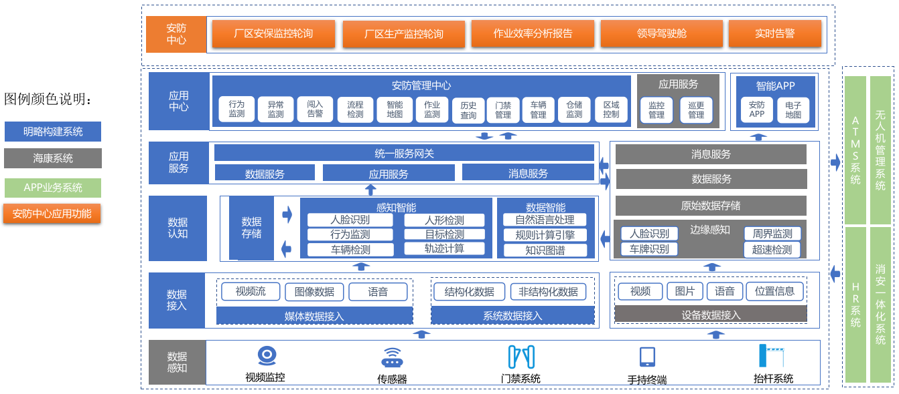
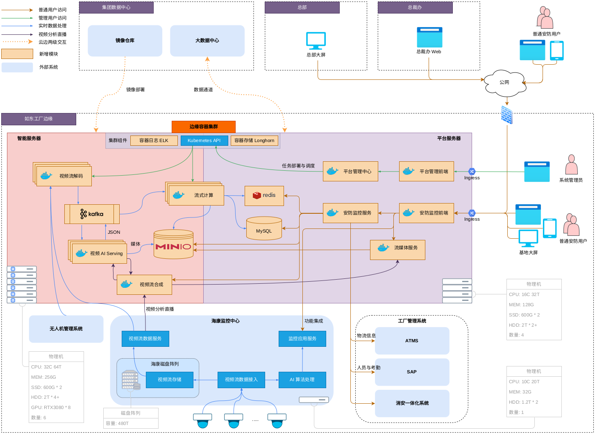
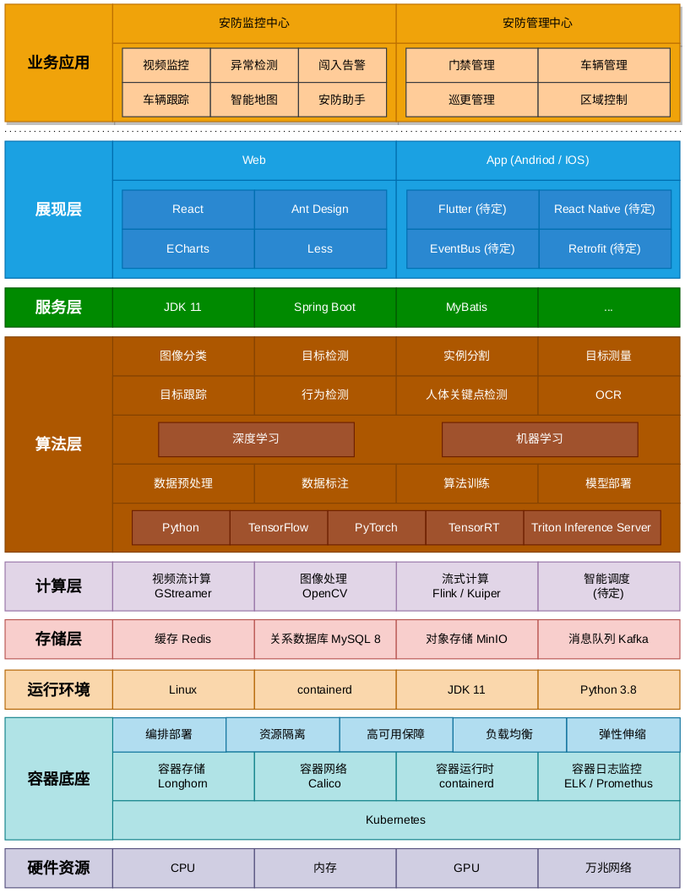
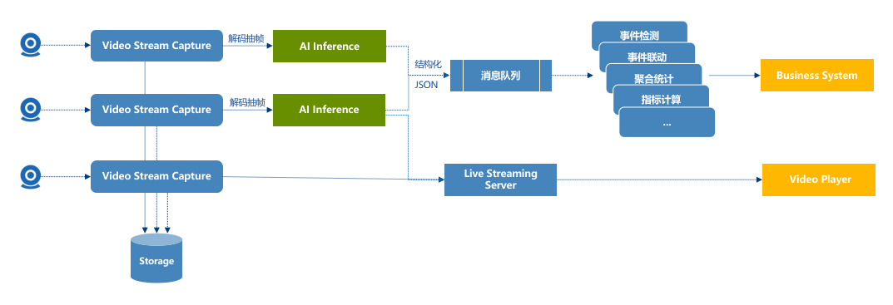

# SOC

- [SOC](#soc)
  - [逻辑架构](#逻辑架构)
  - [部署架构](#部署架构)
  - [技术架构](#技术架构)
  - [数据流向图](#数据流向图)
  - [其他资料](#其他资料)

## 逻辑架构

---

## 部署架构

---

## 技术架构

---

## 数据流向图

---

## 其他资料

[Video Streaming + CV/ML Frameworks](./Video-Streaming_CV%26ML.pdf)
